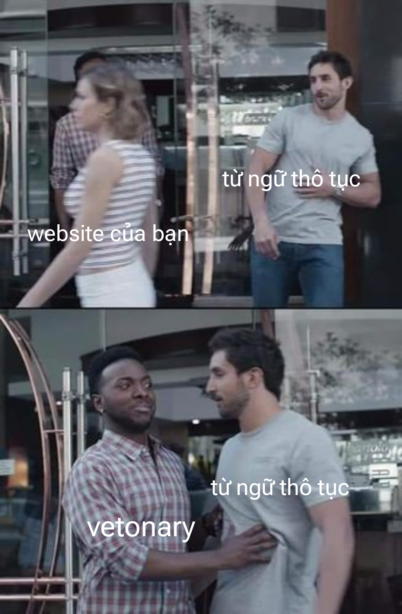

# Chào mừng đến với Vetonary Check APIs

Vetonary APIs cung cấp các công cụ mạnh mẽ cho các nhà phát triển để kiểm tra và phân tích nội dung văn bản để phát hiện những từ ngữ thô tục, phản cảm, không phù hợp. Các API của chúng tôi giúp bạn duy trì một môi trường sạch sẽ và an toàn cho người dùng và cộng đồng của bạn.

  <a href="https://github.com/theanishtar/vetonary"> </img></a>  
  
  
  
  

---

## Phụ lục

- [Mô tả về Server](./README-API.md)
- [Đóng góp](./CONTRIBUTING.md)
- [Danh sách APIs](./APIs.md)

---

Việc kiểm tra các từ ngữ là rất quan trọng với những dự án cộng đồng như mạng xã hội hay diễn đàn

Bạn cũng có thể cung cấp thêm từ ngữ thô tục cho chúng tôi tại [đây](). Rất cảm ơn !

</img>

## Đặc Điểm

- **Phát Hiện Từ Ngữ Thô Tục**: Phát hiện và loại bỏ các từ ngữ thô tục và phản cảm trong nội dung văn bản.
- **Tùy Chỉnh Bộ Lọc Từ**: Tùy chỉnh bộ lọc từ ngữ thô tục dựa trên nhu cầu cụ thể và hướng dẫn của cộng đồng.
- **Phân Tích Văn Bản**: Phân tích nội dung văn bản để tìm từ ngữ không phù hợp, tâm trạng và cách diễn đạt.
- **Mở Rộng và Đáng Tin Cậy**: Các API của chúng tôi được xây dựng để có khả năng mở rộng và đáng tin cậy, đảm bảo hiệu suất cao ngay cả khi có tải nặng.
- **Dễ Dàng Tích Hợp**: Tích hợp đơn giản và dễ dàng với các ứng dụng và nền tảng hiện có của bạn.

## Bắt Đầu

Để bắt đầu sử dụng Vetonary Check APIs trong các dự án của bạn, hãy tuân theo các bước đơn giản sau đây:

1. **Đăng Ký**: Tạo tài khoản trên trang web của chúng tôi và nhận khóa API của bạn.
2. **Tích Hợp APIs**: Theo hướng dẫn trong [Tài Liệu API](apis.md) của chúng tôi để tích hợp các API vào ứng dụng của bạn.
3. **Bắt Đầu Kiểm Tra Từ Ngữ Thô Tục**: Sử dụng các API của chúng tôi để kiểm tra nội dung văn bản để phát hiện từ ngữ thô tục và không phù hợp.

## Lợi Ích

- **Nâng Cao Trải Nghiệm Người Dùng**: Đảm bảo trải nghiệm người dùng tích cực và an toàn bằng cách loại bỏ nội dung không thích hợp.
- **Kiểm Soát Cộng Đồng**: Cung cấp cho các người quản lý cộng đồng của bạn các công cụ mạnh mẽ để duy trì một môi trường lịch sự.
- **Tuân Thủ và Quy Định**: Tuân thủ các quy định và hướng dẫn về kiểm soát nội dung.
- **An Tâm**: Yên tâm rằng các nền tảng của bạn sẽ không chứa từ ngữ thô tục và nội dung không phù hợp.

## Hỗ Trợ và Phản Hồi

Chúng tôi luôn sẵn lòng giúp đỡ bạn mọi lúc! Nếu bạn có bất kỳ câu hỏi, phản hồi hoặc cần trợ giúp, đừng ngần ngại liên hệ với [đội hỗ trợ](mailto:support@vatonary.com) của chúng tôi.

Bắt đầu sử dụng Vetonary Check APIs ngay hôm nay và tạo ra một môi trường

## Những người đóng góp mã nguồn

<html>
<ul style="list-style-type: none; padding: 0; margin: 0;">
    <li style="display: inline-block; margin-right: 10px;">
        
    </li>
    <!-- Add more images as needed -->
</ul>

<a href="./CONTRIBUTING.md">Xem chi tiết</a>
</html>
