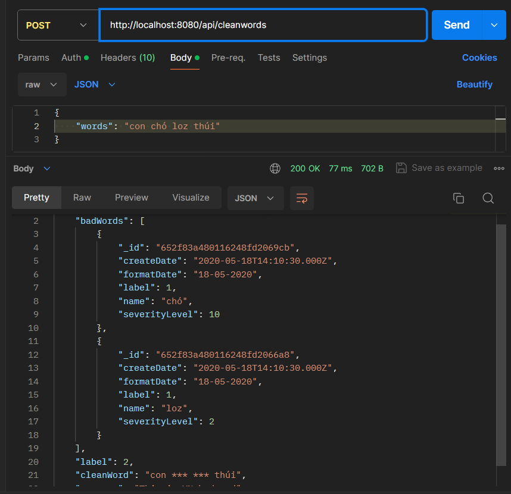

# Check từ ngữ bậy bạ tiếng Việt

</img>
User sẽ gửi dữ liệu lên Request, ví dụ:

```json
POST: http://localhost:8080/api/cleanwords
body: {
  {
    "words": "con chó loz thúi"
  }
}
res: {
  {
    "badWords": [
        {
            "_id": "652f83a480116248fd2069cb",
            "createDate": "2020-05-18T14:10:30.000Z",
            "formatDate": "18-05-2020",
            "label": 1,
            "name": "chó",
            "severityLevel": 10
        },
        {
            "_id": "652f83a480116248fd2066a8",
            "createDate": "2020-05-18T14:10:30.000Z",
            "formatDate": "18-05-2020",
            "label": 1,
            "name": "loz",
            "severityLevel": 2
        }
    ],
    "label": 2,
    "cleanWord": "con *** ***",
    "message": "This is VN badword"
  }
}
```
----
Dữ liệu có chứa `chó` và `loz` là một từ khiếm nhã, xem tất cả tại [đây](https://github.com/frogsage/vietnam-sensitive-words/blob/main/bad_words.json)

vì vậy ta phải giải quyết, ***không cho phép*** `data` trên được lưu vào `database`

## Giải pháp

Kết hợp `MongoDB` và `Redis`

- **MongoDB**: Một `CSDL` ***No-SQL*** lưu trữ Realtime tương tự `Firebase` nhưng bảo mật và tối ưu hơn.
- **Redis**: Một bộ nhớ `Cache` lưu trữ trên `RAM` vì vậy tốc độ nhanh gấp 1000 (*một nghìn*) lần so với My-SQL hay SQL-Server lưu tại **Memory**.


## Thông tin chung

- Dữ liệu sẽ tồn tại trên `MongoDB` (để đảm bảo tính lưu trữ an toàn và lâu dài của dữ liệu)
- Mỗi Request gửi lên server sẽ được check bằng số data ở `Redis` (đảm bảo tốc độ và sự chịu tải của server)
- `MongoDB` sẽ được xem là bảng Backup của `Redis`

### Dữ liệu được lưu trên `MongoDB`


## Luồng xử lý

Lưu trữ từ khóa nhạy cảm trong `MongoDB`:

1. Thiết kế một `collection` trong `MongoDB` để lưu trữ danh sách các từ khóa nhạy cảm. Mỗi từ khóa có thể có một số thuộc tính, chẳng hạn như tên, mức độ nghiêm trọng, và ngày tạo.
Nhập danh sách từ khóa nhạy cảm vào `MongoDB` hoặc cung cấp một giao diện quản trị để quản lý danh sách này.
Sử dụng `Redis` làm `cache`:

2. Khi server khởi động hoặc tải danh sách từ khóa nhạy cảm từ `MongoDB`, lưu trữ chúng trong `Redis` để cung cấp truy cập nhanh chóng.
Sử dụng các thời gian sống **(TTL)** trong `Redis` để tự động xóa `cache` sau một khoảng thời gian cố định để đảm bảo dữ liệu `cache` là cập nhật và không lỗi thời.
Xử lý yêu cầu kiểm tra từ khóa nhạy cảm:

3. Khi một yêu cầu gửi lên server, trước khi xử lý yêu cầu, server sẽ kiểm tra nội dung của yêu cầu xem có chứa từ khóa nhạy cảm hay không.
Server sẽ truy vấn `Redis` để kiểm tra xem từ khóa nhạy cảm có trong `cache` hay không. Nếu từ khóa tồn tại trong `cache`, server có thể ngay lập tức phát hiện và xử lý nội dung nhạy cảm.
Nếu từ khóa không tồn tại trong `cache`, server sẽ thực hiện một truy vấn đến `MongoDB` để kiểm tra từ khóa nhạy cảm và sau đó cập nhật vào `Redis` cho lần sau.
Phản hồi cho người dùng:

4. Server sẽ trả về kết quả kiểm tra từ khóa nhạy cảm cho người dùng. Nếu từ khóa nhạy cảm được phát hiện, server có thể từ chối yêu cầu hoặc thực hiện các biện pháp an toàn, chẳng hạn như ẩn bình luận hoặc chặn nội dung độc hại.
Quản lý và cập nhật danh sách từ khóa nhạy cảm:

5. Cung cấp giao diện quản trị cho quản lý danh sách từ khóa nhạy cảm. Các từ khóa nhạy cảm mới có thể được thêm vào hoặc sửa đổi từ giao diện này và sau đó được cập nhật trong `MongoDB` và `Redis`.

## Các chức năng chính
- Quản lí các từ nhạy cảm `bad-words` **(CRUD)**
- Cập nhật từ MongoDB lên `Redis` (có thể làm tự động)
- Ghi lại số lần được nhắc đến của một từ ngữ (tăng `severityLevel` khi có một `user` gọi đến từ ngữ đó)
- Sắp xếp để thống kê các từ ngữ vi phạm phổ biến
- Ưu tiên kiểm tra các từ ngữ bị vi phạm phổ biến trước

### Đẩy data lên MongoDB

Phân quyền phù hợp và xây dựng trang UI cho `Moderator` quản lí các tác vụ trên

---
## Lưu ý:
Data sẽ tồn tại ở `MongoDB` và `Redis` chỉ lưu tạm thời để tăng tốc độ `caching`


## Các APIs

- Clean words:
  - Dùng để làm sạch các từ ngữ trong một chuỗi, và chuyển chúng thành dạng `beep (*)`
  - Ví dụ: `con chó nhamloz` -> `con *** *******` | vì [***chó, nhamloz là 2 từ xấu***]()


## Bảo mật

Những APIs tương tác với database hoặc CRUD dữ liệu, cần phải truyền token để sử dụng
